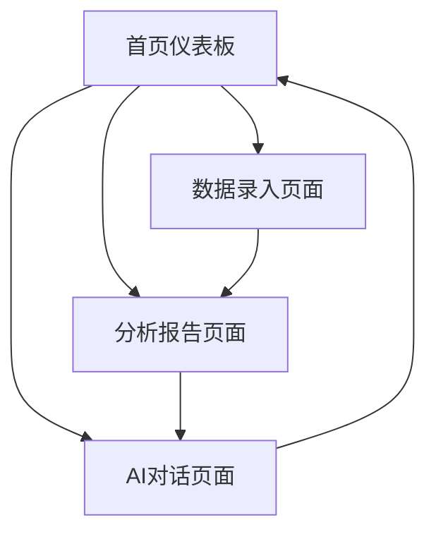

## 1. 产品概述
智能预算分析AI机器人是一款专为个人和小微企业设计的智能财务管理工具。通过AI技术自动分析收支情况，提供个性化的财务建议和预算管理。

解决用户手动记账繁琐、财务分析困难的问题，帮助用户更好地理解和管理自己的财务状况，实现智能理财目标。

## 2. 核心功能

### 2.1 用户角色
| 角色 | 注册方式 | 核心权限 |
|------|----------|----------|
| 个人用户 | 邮箱/手机号注册 | 个人财务管理、预算设置、AI对话 |
| 企业用户 | 邮箱注册+企业认证 | 多账户管理、团队协作、高级报表 |

### 2.2 功能模块
核心页面包括：
1. **首页仪表板**：数据概览、快速录入、AI助手入口
2. **数据录入页面**：手动录入、文件上传、收据扫描
3. **分析报告页面**：图表展示、趋势分析、异常提醒
4. **AI对话页面**：自然语言查询、智能建议、预算规划

### 2.3 页面详情
| 页面名称 | 模块名称 | 功能描述 |
|-----------|-------------|---------------------|
| 首页仪表板 | 数据概览 | 显示当月收支总额、预算执行率、主要支出类别占比 |
| 首页仪表板 | 快速录入 | 提供快捷按钮进行收入/支出记录，支持语音输入 |
| 首页仪表板 | AI助手入口 | 显示未读消息数，一键进入AI对话界面 |
| 数据录入页面 | 手动录入 | 输入金额、选择类别、添加备注、设置时间 |
| 数据录入页面 | 文件上传 | 支持CSV、Excel文件导入，自动解析和分类 |
| 数据录入页面 | 收据扫描 | 拍照识别收据内容，OCR提取关键信息 |
| 分析报告页面 | 图表展示 | 折线图显示收支趋势，饼图展示类别分布 |
| 分析报告页面 | 趋势分析 | 对比不同时期数据，识别消费模式变化 |
| 分析报告页面 | 异常提醒 | 高亮显示异常支出，发送预算超支警告 |
| AI对话页面 | 自然语言查询 | 支持"上个月餐饮花了多少钱"等自然语言提问 |
| AI对话页面 | 智能建议 | 基于历史数据提供节省建议和预算优化方案 |
| AI对话页面 | 预算规划 | 预测未来收支，制定个性化储蓄计划 |

## 3. 核心流程
用户主要操作流程：
1. **新用户流程**：注册登录 → 设置初始预算 → 录入首笔交易 → 查看分析结果 → 使用AI助手
2. **日常记录流程**：快速录入/上传收据 → AI自动分类 → 查看分类结果 → 接收异常提醒
3. **分析查询流程**：进入AI对话 → 自然语言提问 → 获得数据分析 → 接收建议

## 4. 用户界面设计

### 4.1 设计风格
- **主色调**：深绿色(#2E7D32)代表财富，搭配浅灰色(#F5F5F5)背景
- **按钮样式**：圆角矩形，悬停效果，主要操作用实心按钮
- **字体选择**：中文使用思源黑体，数字使用Roboto，正文字号14px
- **布局风格**：卡片式布局，顶部导航栏，侧边栏快捷菜单
- **图标风格**：使用线性图标，简洁现代，符合财务主题

### 4.2 页面设计概览
| 页面名称 | 模块名称 | UI元素 |
|-----------|-------------|-------------|
| 首页仪表板 | 数据概览 | 顶部显示总收入/支出卡片，使用大号字体和醒目颜色，预算进度条使用渐变色 |
| 首页仪表板 | 快速录入 | 底部悬浮按钮，包含收入(+绿色)和支出(-红色)两个选项 |
| 数据录入页面 | 手动录入 | 表单使用分步设计，金额输入框放大显示，类别选择使用图标+文字 |
| 分析报告页面 | 图表展示 | 使用Chart.js库，折线图显示月度趋势，支持手势缩放 |
| AI对话页面 | 对话界面 | 类似微信聊天界面，用户消息右对齐，AI回复左对齐，支持语音输入 |

### 4.3 响应式设计
采用桌面优先设计，适配1200px以上大屏幕显示完整信息。移动端自适应，核心功能放在底部标签栏，确保单手操作便利性。触摸交互优化，支持滑动切换图表、长按编辑交易记录等手势操作。