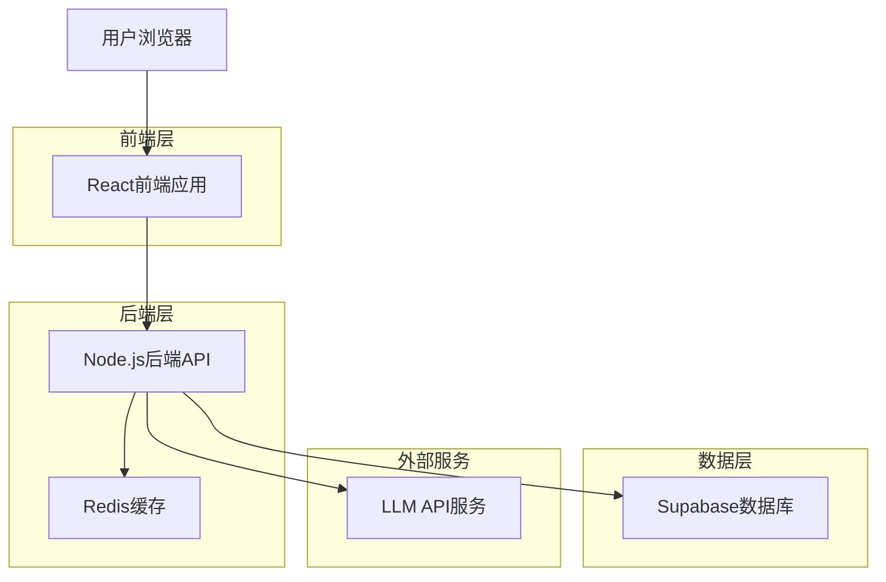
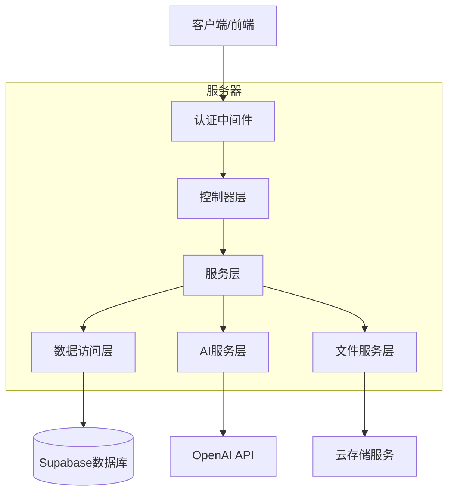
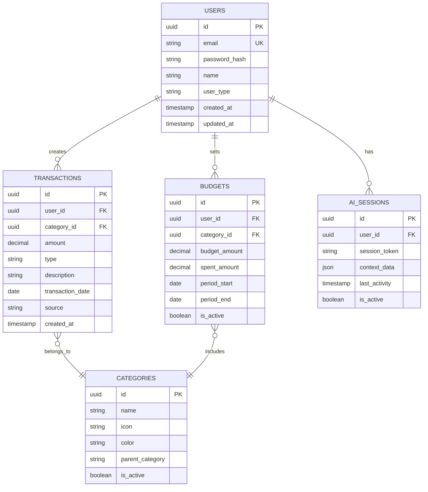

## 1. 架构设计



## 2. 技术描述
- 前端：React@18 + TypeScript + TailwindCSS@3 + Vite
- 初始化工具：vite-init
- 后端：Node.js@18 + Express@4 + TypeScript
- 数据库：Supabase (PostgreSQL)
- AI集成：OpenAI GPT-4 API
- 图表库：Chart.js + react-chartjs-2
- OCR服务：Google Cloud Vision API
- 状态管理：Zustand
- 表单处理：React Hook Form + Zod

## 3. 路由定义
| 路由 | 用途 |
|-------|---------|
| / | 首页仪表板，显示财务概览 |
| /login | 登录页面，用户身份验证 |
| /register | 注册页面，新用户注册 |
| /dashboard | 数据录入页面，支持多种录入方式 |
| /reports | 分析报告页面，展示图表和分析结果 |
| /ai-chat | AI对话页面，自然语言交互 |
| /settings | 设置页面，用户偏好和预算配置 |
| /profile | 用户资料页面，个人信息管理 |

## 4. API定义

### 4.1 用户认证API
```
POST /api/auth/register
```
请求：
| 参数名 | 参数类型 | 是否必需 | 描述 |
|-----------|-------------|-------------|-------------|
| email | string | 是 | 用户邮箱地址 |
| password | string | 是 | 用户密码 |
| name | string | 是 | 用户姓名 |
| userType | string | 是 | 用户类型(personal/business) |

响应：
| 参数名 | 参数类型 | 描述 |
|-----------|-------------|-------------|
| success | boolean | 注册成功状态 |
| token | string | JWT访问令牌 |
| user | object | 用户信息对象 |

### 4.2 交易记录API
```
POST /api/transactions
```
请求：
| 参数名 | 参数类型 | 是否必需 | 描述 |
|-----------|-------------|-------------|-------------|
| amount | number | 是 | 交易金额 |
| category | string | 是 | 交易类别 |
| type | string | 是 | 交易类型(income/expense) |
| description | string | 否 | 交易描述 |
| date | string | 是 | 交易日期 |

### 4.3 AI分析API
```
POST /api/ai/analyze
```
请求：
| 参数名 | 参数类型 | 是否必需 | 描述 |
|-----------|-------------|-------------|-------------|
| query | string | 是 | 自然语言查询 |
| context | object | 否 | 用户上下文信息 |

响应：
| 参数名 | 参数类型 | 描述 |
|-----------|-------------|-------------|
| answer | string | AI分析结果 |
| chartData | object | 图表数据(可选) |
| suggestions | array | 财务建议列表 |

## 5. 服务器架构图


## 6. 数据模型

### 6.1 数据模型定义


### 6.2 数据定义语言
用户表 (users)
```sql
-- 创建用户表
CREATE TABLE users (
    id UUID PRIMARY KEY DEFAULT gen_random_uuid(),
    email VARCHAR(255) UNIQUE NOT NULL,
    password_hash VARCHAR(255) NOT NULL,
    name VARCHAR(100) NOT NULL,
    user_type VARCHAR(20) DEFAULT 'personal' CHECK (user_type IN ('personal', 'business')),
    created_at TIMESTAMP WITH TIME ZONE DEFAULT NOW(),
    updated_at TIMESTAMP WITH TIME ZONE DEFAULT NOW()
);

-- 创建交易记录表
CREATE TABLE transactions (
    id UUID PRIMARY KEY DEFAULT gen_random_uuid(),
    user_id UUID NOT NULL REFERENCES users(id) ON DELETE CASCADE,
    category_id UUID NOT NULL,
    amount DECIMAL(12,2) NOT NULL,
    type VARCHAR(10) NOT NULL CHECK (type IN ('income', 'expense')),
    description TEXT,
    transaction_date DATE NOT NULL,
    source VARCHAR(50) DEFAULT 'manual',
    created_at TIMESTAMP WITH TIME ZONE DEFAULT NOW(),
    updated_at TIMESTAMP WITH TIME ZONE DEFAULT NOW()
);

-- 创建类别表
CREATE TABLE categories (
    id UUID PRIMARY KEY DEFAULT gen_random_uuid(),
    name VARCHAR(50) NOT NULL,
    icon VARCHAR(50),
    color VARCHAR(7),
    parent_category VARCHAR(50),
    is_active BOOLEAN DEFAULT true
);

-- 创建预算表
CREATE TABLE budgets (
    id UUID PRIMARY KEY DEFAULT gen_random_uuid(),
    user_id UUID NOT NULL REFERENCES users(id) ON DELETE CASCADE,
    category_id UUID NOT NULL,
    budget_amount DECIMAL(12,2) NOT NULL,
    spent_amount DECIMAL(12,2) DEFAULT 0,
    period_start DATE NOT NULL,
    period_end DATE NOT NULL,
    is_active BOOLEAN DEFAULT true,
    created_at TIMESTAMP WITH TIME ZONE DEFAULT NOW()
);

-- 创建AI会话表
CREATE TABLE ai_sessions (
    id UUID PRIMARY KEY DEFAULT gen_random_uuid(),
    user_id UUID NOT NULL REFERENCES users(id) ON DELETE CASCADE,
    session_token VARCHAR(255) UNIQUE NOT NULL,
    context_data JSONB,
    last_activity TIMESTAMP WITH TIME ZONE DEFAULT NOW(),
    is_active BOOLEAN DEFAULT true
);

-- 创建索引
CREATE INDEX idx_transactions_user_id ON transactions(user_id);
CREATE INDEX idx_transactions_date ON transactions(transaction_date);
CREATE INDEX idx_transactions_category ON transactions(category_id);
CREATE INDEX idx_budgets_user_id ON budgets(user_id);
CREATE INDEX idx_ai_sessions_user_id ON ai_sessions(user_id);
CREATE INDEX idx_ai_sessions_token ON ai_sessions(session_token);

-- 设置权限
GRANT SELECT ON users TO anon;
GRANT ALL PRIVILEGES ON users TO authenticated;
GRANT SELECT ON transactions TO anon;
GRANT ALL PRIVILEGES ON transactions TO authenticated;
GRANT SELECT ON categories TO anon;
GRANT ALL PRIVILEGES ON categories TO authenticated;
GRANT SELECT ON budgets TO anon;
GRANT ALL PRIVILEGES ON budgets TO authenticated;
GRANT SELECT ON ai_sessions TO anon;
GRANT ALL PRIVILEGES ON ai_sessions TO authenticated;

-- 初始化类别数据
INSERT INTO categories (name, icon, color, parent_category) VALUES
('餐饮', '🍽️', '#FF6B6B', '生活费用'),
('交通', '🚗', '#4ECDC4', '生活费用'),
('购物', '🛍️', '#45B7D1', '生活费用'),
('娱乐', '🎬', '#96CEB4', '生活费用'),
('医疗', '🏥', '#FFEAA7', '生活费用'),
('教育', '📚', '#DDA0DD', '投资支出'),
('工资', '💰', '#2ECC71', '收入来源'),
('投资收益', '📈', '#F39C12', '收入来源'),
('其他收入', '💡', '#9B59B6', '收入来源'),
('房租', '🏠', '#E74C3C', '固定支出'),
('水电费', '💡', '#34495E', '固定支出');
```