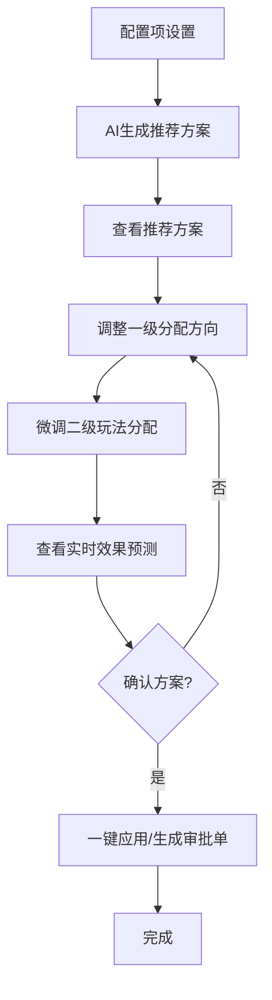

## 1. 模块概述

预算分配优化模块是AI预算助手中的核心功能模块，专为业务预算管理者设计。通过AI算法智能推荐预算分配方案，支持手动调整预算分配，并实时预测分配效果，帮助用户实现最优的预算资源配置。

解决用户预算分配依赖经验、效果难以预估、调整成本高的问题，通过数据驱动的方式提供智能预算分配建议，提升预算使用效率和ROI。

## 2. 核心功能

### 2.1 用户角色
| 角色 | 使用场景 | 核心权限 |
|------|----------|----------|
| 业务预算管理者 | 季度/月度预算分配 | 查看AI推荐方案、手动调整预算、应用分配方案、导出明细 |
| 财务BP | 预算审批支持 | 查看分配方案、对比多版本、生成审批单 |

### 2.2 功能模块
核心页面包括：
1. **配置项区域**：设置预算周期、业务范围、约束条件等
2. **预算分配工作台**：查看AI推荐方案、手动调整一级和二级预算分配
3. **实时效果预测**：展示预算消耗、增量收益、钱效指标预测

### 2.3 页面详情
| 区域名称 | 模块名称 | 功能描述 |
|-----------|-------------|---------------------|
| 配置项区域 | 一键收起/展开 | 提供"收起全部"和"展开全部"按钮，快速控制所有配置项的显示状态 |
| 配置项区域 | 预算周期设置 | 选择预算分配的时间周期（季度、月度、自定义周期） |
| 配置项区域 | 业务范围选择 | 选择参与预算分配的业务线、渠道、产品等维度 |
| 配置项区域 | 约束条件设置 | 设置预算上限、下限、ROI目标等约束条件 |
| 预算分配工作台 | 自负盈亏业务预算总览 | 展示不参与分配的自负盈亏业务预算，作为分配基线，不可手动调整 |
| 预算分配工作台 | AI推荐预算分配 | 展示AI算法推荐的预算分配方案，包含一级分配方向和二级玩法分配 |
| 预算分配工作台 | 一级分配方向调整 | 支持直接修改GMV增长、DAU增长、DAC优化三个一级方向的总预算金额，修改后自动按比例调整子项 |
| 预算分配工作台 | 二级玩法分配调整 | 每个一级方向下的具体玩法预算，通过滑块控件进行微调 |
| 预算分配工作台 | 一键应用AI推荐方案 | 将当前调整后的方案重置为AI推荐的初始方案 |
| 预算分配工作台 | 重置为当前生效方案 | 将方案重置为当前正在执行的预算分配方案 |
| 预算分配工作台 | 导出分配明细 | 导出Excel格式的预算分配明细表 |
| 预算分配工作台 | 生成预算调整审批单 | 一键生成包含分配方案的审批单据 |
| 实时效果预测 | 预算消耗情况 | 展示整体预计总消耗、各方向消耗、剩余机动预算，避免超支 |
| 实时效果预测 | 增量收益预测 | 展示预计增量GMV、预计DAU峰值、预计用户获取成本（DAC） |
| 实时效果预测 | 钱效指标预测 | 展示增量GMV兑换比、REV_ROI、费率等核心钱效指标 |
| 实时效果预测 | 查看预测逻辑明细 | 查看AI预测算法的详细逻辑和依据 |
| 实时效果预测 | 对比多版本方案 | 支持对比多个不同预算分配方案的效果预测 |

## 3. 核心流程

用户主要操作流程：
1. **配置流程**：进入预算分配优化 → 设置配置项 → 确认约束条件
2. **分配流程**：查看AI推荐方案 → 调整一级分配方向 → 微调二级玩法分配 → 查看实时效果预测
3. **应用流程**：对比多版本方案 → 确认最优方案 → 一键应用或生成审批单

## 4. 用户界面设计

### 4.1 设计风格
- **主色调**：蓝色系(#3B82F6)代表专业和信任，配合绿色(#10B981)表示增长，橙色(#F59E0B)表示优化
- **按钮样式**：圆角矩形，主要操作用实心蓝色按钮，次要操作用白色边框按钮
- **字体选择**：中文使用思源黑体，数字使用Roboto，正文字号14px，预算金额使用加粗大号字体
- **布局风格**：三栏式布局（左配置、中工作台、右预测），卡片式设计，清晰的视觉层次
- **图标风格**：使用线性图标，简洁现代，符合企业级产品风格

### 4.2 页面设计概览
| 区域名称 | 模块名称 | UI元素 |
|-----------|-------------|-------------|
| 配置项区域 | 一键收起/展开 | 顶部右侧两个按钮："收起全部"和"展开全部"，点击后所有配置项同步收起或展开 |
| 配置项区域 | 配置项卡片 | 可折叠的卡片设计，包含标题栏（带展开/收起图标）和内容区域 |
| 预算分配工作台 | 自负盈亏业务预算总览 | 蓝色边框卡片，表格展示业务名称、当前分配预算、占比、状态，底部有说明文字 |
| 预算分配工作台 | AI推荐预算分配 | 白色卡片，表格形式展示，一级方向使用渐变色背景，二级玩法缩进显示 |
| 预算分配工作台 | 一级分配方向调整 | 数字输入框，带货币符号和单位，有最小/最大值限制，输入时显示焦点边框 |
| 预算分配工作台 | 二级玩法分配调整 | 滑块控件，显示当前值，实时更新右侧预测数据 |
| 预算分配工作台 | 操作按钮区 | 四个操作按钮横向排列：一键应用、重置、导出、生成审批单 |
| 实时效果预测 | 预算消耗情况 | 卡片式布局，整体消耗使用大号加粗字体，各方向消耗显示环比变化和颜色标识 |
| 实时效果预测 | 增量收益预测 | 三个指标卡片，使用不同背景色（绿色、蓝色、橙色），指标值使用超大字体 |
| 实时效果预测 | 钱效指标预测 | 列表形式展示，每个指标显示当前值和环比变化 |

### 4.3 交互设计
- **实时反馈**：调整预算后，右侧预测数据立即更新，无需等待
- **拖拽调整**：支持通过拖拽调整聊天区域和报告区域的宽度
- **一键操作**：提供一键应用、一键重置等快捷操作，提升效率
- **状态提示**：使用颜色标识（绿色=正向、红色=负向）和图标（🟢=健康、🔴=风险）直观展示状态
